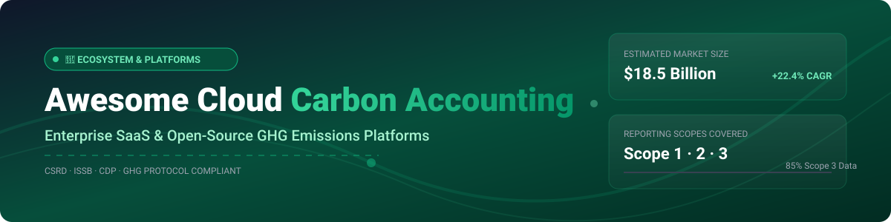

# Awesome Cloud Carbon Accounting 🌿📊

  
  
  
  

## 🚀 Top Cloud Carbon Accounting Platforms & Software Ecosystem

**Curated List of SaaS Products & Open-Source GitHub Projects for Enterprise Decarbonization & Greenhouse Gas (GHG) Emissions Tracking** 🌍⚡

*Focused on Scope 1, Scope 2, Scope 3 Emissions Calculation, Carbon Footprint Reporting, Regulatory Compliance (CSRD, ISSB, CDP, SEC), & Supply Chain Decarbonization.*

---

### 📌 Overview & Market Landscape

This repository tracks notable **SaaS platforms** and **open-source software** for **Cloud Carbon Accounting** and **Enterprise Climate Intelligence**. These solutions empower organizations to measure, track, audit, and report greenhouse gas emissions across Scopes 1, 2, and 3, achieve compliance with global regulations, and automate ESG disclosures.

> 📊 **Market Insights**: The global carbon accounting software market size is estimated at **$18.5 Billion by 2030** (growing at a ~22.4% CAGR). The market is currently **moderately fragmented** with major enterprise software suites (Microsoft, IBM, Sphera) alongside specialized climate-tech unicorns (Watershed, Sweep, Persefoni), though enterprise consolidation is accelerating due to complex audit and CSRD compliance requirements.

---

## 📑 Table of Contents

- [🏢 SaaS & Hosted Enterprise Platforms](#-saas--hosted-enterprise-platforms)
- [💻 Open-Source GitHub Projects](#-open-source-github-projects)
- [🤝 How to Contribute](#-how-to-contribute)
- [💖 Support & Community](#-support--community)
- [📈 Star History](#-star-history)
- [⚠️ Disclaimer](#%EF%B8%8F-disclaimer)

---

## 🏢 SaaS & Hosted Enterprise Platforms

The table below summarizes leading commercial carbon accounting and ESG platforms, sorted by **Market Valuation / Annual Revenue (Descending)**.

| Platform | Market Size / Valuation / Revenue | Starting Pricing Tier | Free Tier / Trial Limits | Key Features & Focus |
| :--- | :--- | :--- | :--- | :--- |
| **[Microsoft Cloud for Sustainability](https://www.microsoft.com/en-us/sustainability/cloud)** | **~$3.1 Trillion** *(Microsoft Corp Valuation)* | $1,200 / tenant / month (Sustainability Manager) | 30-day full-feature trial (max 25 users, demo data) | Enterprise GHG tracking across Scopes 1-3 built on Dynamics 365 & Power Platform. |
| **[IBM Envizi](https://www.ibm.com/products/envizi)** | **~$210 Billion** *(IBM Market Cap)* | $18,000 / year base platform tier | 14-day guided enterprise trial sandbox | Industrial-grade ESG data management, automated utility metering, & CSRD governance. |
| **[SpheraCloud](https://sphera.com/)** | **~$1.4 Billion** *(Blackstone Acquisition)* | $15,000 / year starter suite | 14-day enterprise request-access trial | Comprehensive LCA, product carbon footprinting (PCF), & complex supply chain tracking. |
| **[Watershed](https://watershed.com/)** | **$1.8 Billion** *(Series C Valuation)* | $10,000 / year core platform | 14-day interactive demo sandbox (guided) | AI disclosure drafting, CDP API automated filing, handling 3+ gigatonnes emissions. |
| **[Persefoni](https://www.persefoni.com/)** | **~$750 Million** *(Valuation)* | $500 / month (Pro Tier) | **Free Forever Plan** (Persefoni Pro Starter for single entities & basic Scope 1-2) | PCAF-aligned financed emissions reporting for banking, private equity, & asset managers. |
| **[Sweep](https://www.sweep.net/)** | **~$300 Million** *(Series B Valuation)* | $1,200 / month ($14,400/yr) | 14-day free trial workspace | "Report once, file everywhere" CSRD/ISSB multi-framework mapping with auditor access portal. |
| **[Normative](https://normative.io/)** | **~$100 Million** *(Total Funding ~$50M)* | $800 / month starter | 30-day trial for SME carbon footprinting | Automated carbon accounting, supplier engagement, & granular Scope 3 footprinting. |
| **[Plan A](https://plana.earth/)** | **~$80 Million** *(Total Funding ~$43M)* | $1,000 / month core plan | 14-day free trial environment | EU decarbonization platform with automated CSRD/ISSB compliance mapping. |
| **[Greenly](https://greenly.earth/)** | **~$75 Million** *(Total Funding ~$73M)* | $1,950 / year SME starter plan | 7-day free trial workspace | Fast SME carbon footprint assessment, bank account transaction integration, & LCA tools. |
| **[Emitwise](https://www.emitwise.com/)** | **~$30 Million** *(Total Funding ~$17M)* | $1,200 / month starter | 14-day demo environment trial | Supply chain carbon accounting & complex manufacturing carbon footprinting. |

---

## 💻 Open-Source GitHub Projects

Community-driven, self-hostable tools and open libraries for carbon calculation and climate data analysis, sorted by **GitHub Stars (Descending)**.

- **[codecarbon](https://github.com/mlco2/codecarbon)**   
  **Python package for tracking compute carbon emissions.** Estimates CO₂ hardware emissions from CPU, GPU, and RAM compute workloads by tracking electricity consumption across cloud locations (AWS, GCP, Azure). 🐍⚡

- **[cloud-carbon-footprint](https://github.com/cloud-carbon-footprint/cloud-carbon-footprint)**   
  **Cloud Carbon Footprint measurement architecture.** Provides a comprehensive framework to measure, visualize, and reduce cloud carbon emissions across AWS, Google Cloud, and Microsoft Azure. Includes dashboards, CLI, and REST APIs. ☁️🌱

- **[impact](https://github.com/mlco2/impact)**   
  **Calculator for machine learning carbon footprint.** Web app & LaTeX calculator that estimates greenhouse gas emissions generated by training machine learning models based on hardware specifications and data center power usage efficiency. 🤖📈

- **[blockchain-carbon-accounting](https://github.com/hyperledger-labs/blockchain-carbon-accounting)**   
  **Hyperledger climate action & automated carbon accounting.** Open-source utility using blockchain smart contracts to track carbon emissions, issue carbon offsets, and automate climate data auditing across enterprise supply chains. ⛓️🌱

- **[open-grid-emissions](https://github.com/singularity-energy/open-grid-emissions)**   
  **Hourly grid emissions data pipeline.** Python data processing pipeline providing high-resolution hourly power grid generation and carbon emissions factors across the United States for accurate Scope 2 accounting. ⚡📊

- **[awesome-sustainable-finance](https://github.com/open-risk/awesome-sustainable-finance)**   
  **Curated list of open-source sustainable finance & ESG tools.** Covers climate risk modeling, portfolio carbon accounting, PCAF implementations, and financial sustainability data frameworks. 💰📋

- **[FLINT (moja global)](https://github.com/moja-global/FLINT)**   
  **Full Lands Integration Tool for AFOLU carbon accounting.** Government-backed C++ simulation engine for measuring, reporting, and verifying (MRV) greenhouse gas fluxes from forestry and agricultural land use. 🌲🌾

- **[ghg-calculator](https://github.com/starrybodies/ghg-calculator)**   
  **GHG Protocol compliant carbon calculator CLI & MCP server.** Python CLI tool with 900+ built-in IPCC/EPA emission factors for automated Scope 1, 2, and 3 accounting with Model Context Protocol support. 🧮🤖

- **[carbonink](https://github.com/lxzxl/carbonink)**   
  **Desktop local-first GHG carbon accounting app.** Offline cross-platform app (macOS & Windows) featuring AI utility bill parsing, ISO 14064-1 report generation, and zero cloud dependency. 🖥️📄

- **[greenops-carbon-accounting-platform](https://github.com/cherryaugusta/greenops-carbon-accounting-platform)**   
  **Full-stack Django & React ESG carbon platform.** Web application for employee travel/energy logging, manager approval workflows, JWT authentication, and automated carbon footprint reporting. 🐳💻

- **[OpenGHG](https://github.com/mindsongreen/OpenGHG)**   
  **Auditable carbon footprint calculator engine.** PHP/PostgreSQL transparent calculator emphasizing strict data separation between activity data, emission factors, and calculation logic. 🐘🔍

---

## 🤝 How to Contribute

Contributions are welcome! Please follow these simple guidelines:

1. Fork the repository 🍴
2. Create your feature branch (`git checkout -b feature/amazing-tool`) 🌿
3. Add the SaaS platform or Open-Source project in its designated place 📝
4. Open a Pull Request with a short summary of the additions 🚀

For awesome list formatting rules, check [Awesome-Awesome-Awesome](https://github.com/ishandutta2007/Awesome-Awesome-Awesome).

---

## 💖 Support & Community

If you find this list helpful, consider supporting the project:

- ⭐ **Star** this repository to show your appreciation!
- 🔀 **Fork** and share with fellow sustainability engineers & ESG managers!
- 💬 Join our community on [Discord](https://discord.gg/jc4xtF58Ve)!
- ☕ Support ongoing maintenance via [GitHub Sponsors](https://github.com/sponsors/ishandutta2007)!

---

## 📈 Star History

---

## ⚠️ Disclaimer

- This list is community-curated for informational purposes and does not constitute official financial or sustainability audit advice.
- Always verify carbon accounting methodologies against [GHG Protocol](https://ghgprotocol.org/) and ISO 14064 standards prior to official regulatory filings.
